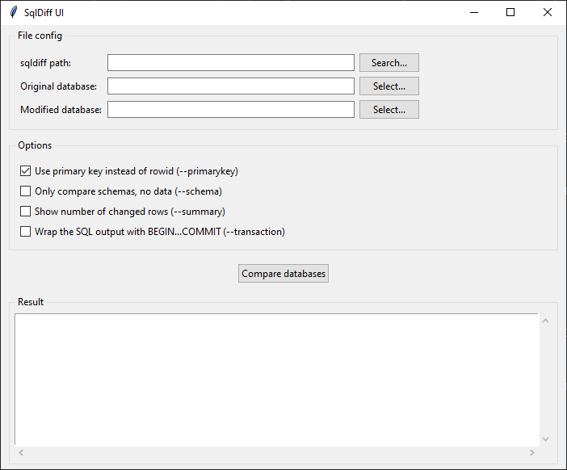

# SQLDiff UI

A lightweight, user-friendly graphical interface (GUI) built with Python and [Tkinter](https://docs.python.org/3/library/tkinter.html) to compare [SQLite](https://www.sqlite.org) databases. This tool wraps around the official SQLite [`sqldiff`](https://www.sqlite.org/sqldiff.html) utility, eliminating the need to use the command line for database diffing.



## Features

- **Graphical File Selection:** Easily browse and select your SQLite database files and the `sqldiff` executable.
- **Configurable Diff Flags:** Toggle official `sqldiff` options directly from the UI:
  - `--primarykey`: Use the primary key instead of rowid (enabled by default).
  - `--schema`: Compare database schemas only.
  - `--summary`: Show a summary of differences.
  - `--transaction`: Wrap the output script in a transaction.

## Development

### Setting Up the Environment

This project uses [uv](https://docs.astral.sh/uv). To set up your local development environment and install all required dependencies, run:

```bash
uv sync
```

### Local Builds

The project uses [PyInstaller](https://pyinstaller.org) to package the application into a standalone executable. To build the binary locally for your current operating system, execute the following command:

```bash
uv run pyinstaller --onefile --windowed --name="SqlDiffUI" main.py
```

> 💡 **Note:** Once the build process completes, you can find the generated executable inside the `dist/` directory.

### Publishing a New Version

Production releases are automated via GitHub Actions. The CI/CD workflow triggers automatically whenever a new version tag is pushed to the repository.
To publish a new release, follow these steps:

1. **Create a new version tag** (ensure it follows the [semantic versioning format](https://semver.org) and starts with a `v`):

   ```bash
   git tag v1.0.0
   ```

2. **Push the tag to GitHub** to trigger the automated release workflow:

   ```bash
   git push origin v1.0.0
   ```

The GitHub Action will automatically compile the executables for both Windows and Linux, create a new Release on your repository, and attach the binaries as assets.
